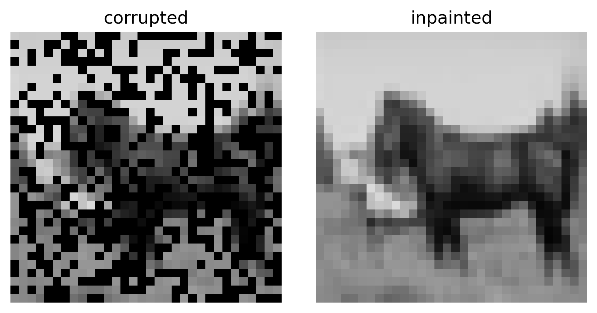

# ddpm-inpainting

Conditional diffusion for image reconstruction from corrupted or sparse observations using PyTorch.

This repository implements a **conditional denoising diffusion probabilistic model (DDPM)** for recovering dense images from degraded inputs. The model learns to reconstruct structure from heavily corrupted conditioning signals by modeling the conditional distribution p(x | c).

The implementation does **not** use classifier-free guidance or explicit mask-projection inpainting. Instead, reconstruction is achieved purely through conditional score learning.

---

## Example: Corrupted → Reconstructed

The figure below demonstrates reconstruction from a heavily corrupted conditioning input. The left panel shows the corrupted observation used as the condition. The right panel shows the reconstructed image produced by the conditional diffusion model.



The model infers missing structure and restores semantic consistency even when large portions of the image are noisy or absent.

---

## Core Idea

The objective is to learn the conditional score function

```
∇x log p(x | c)
```

where:

* x = target (ground truth image)
* c = conditioning input (corrupted or sparse image)

The learned score enables sampling from the posterior distribution of plausible reconstructions conditioned on observations.

---

## Diffusion Formulation

A DDPM learns to reverse a Markov noising process.

Forward process:

```
q(x_t | x_0) = sqrt(ᾱ_t) x_0 + sqrt(1 − ᾱ_t) ε
```

where ε ~ N(0, I).

The neural network learns to predict ε:

```
ε_θ(x_t, t, c)
```

Training objective:

```
L = || ε − ε_θ(x_t, t, c) ||²
```

After training, reconstruction proceeds by iteratively denoising from Gaussian noise while conditioning on the corrupted input.

---

## Conditional Reconstruction

Instead of modeling p(x), the model learns:

```
p(x | c)
```

where c is an observed degraded version of the image.

Examples of conditioning include:

* Sparse pixels
* Corrupted measurements
* Low-quality reconstructions
* Partial observations
* Physics-derived fields

The network receives both the noisy sample x_t and the condition c and predicts the noise consistent with the condition.

This produces reconstructions that are statistically consistent with both the learned data distribution and the conditioning signal.

---

## Reconstruction Interpretation

The reverse diffusion trajectory can be interpreted as approximate sampling from the posterior distribution:

```
p(x | c)
```

Thus reconstruction emerges as a stochastic inverse problem solution where the model balances:

* learned image prior
* observation consistency

No explicit masking or projection constraints are required.

---

## Architecture

The model uses a conditional U-Net with:

* Sinusoidal time embeddings
* Residual convolutional blocks
* Linear attention layers
* Cross-attention conditioning
* Control encoder for conditioning image

The conditioning pathway encodes spatial structure and injects features at multiple resolutions throughout the network hierarchy.

---

## Summary

This repository demonstrates how conditional diffusion models can solve reconstruction problems by learning the conditional score function and sampling from the resulting posterior distribution given corrupted observations.
